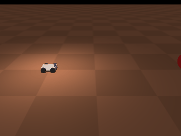

# FlyRover

Bio-Inspired Autonomous Rover (Mars Surface Application) - ITU Sistem Takımı



## Proje Hedefi (Project Goal)
Meyve sineği (*Drosophila melanogaster*) beyninin gerçek bağlantı haritasından (FlyWire connectome) türetilen bir spiking sinir ağının, 3D simülasyonda bir Mars rover'ını **sürmesi** ve robot kolla **cisimleri tutup kaldırması**. Açık kaynak, sadece simülasyon projesidir.

**Durum:** Faz 1 (kaçış) tamamlandı — üstüne gelen topu gören rover, sadece connectome ağıyla geri kaçıyor. Plan ve fazlar: [docs/yol_haritasi.md](docs/yol_haritasi.md)

## Mimari (Architecture)
```
MuJoCo kamerası ─► Kodlayıcı ─► Sinek connectome SNN'i (Brian2) ─► Çözücü ─► Teker / kol
```
- **Kodlayıcı:** Kameradan yaklaşan tehdit / hedef bilgisini çıkarır, görsel nöronlara (LC4, LPLC2, LC10a) Poisson spike girdisi olarak verir.
- **SNN:** FlyWire v783'ten hücre tipi seviyesinde graf (`config/type_graph.json`); Shiu et al. 2024 LIF modeli.
- **Çözücü:** İnen nöronların (GF, DNp02/04, MDN, BPN, DNa02...) ateşleme hızlarını rover komutuna çevirir.
- **Rover Alt Ağı** (Faz 1–3) ve **Kol Alt Ağı** (Faz 4) — kol, rover sürüşü tamamlandıktan sonra eklenecek.

Detaylar: [Kapalı döngü](docs/mimari_kararlar/kapali_dongu.md) · [Hücre tipi grafı](docs/mimari_kararlar/hucre_tipi_grafi.md) · [Rover nöronları](docs/mimari_kararlar/rover_neurons.md) · [Görsel algı](docs/mimari_kararlar/visual_perception_navigation.md)

## Hızlı Başlangıç (Windows)
```bash
py -m venv venv
venv/Scripts/python -m pip install -r requirements.txt

venv/Scripts/python src/data/build_type_graph.py     # grafı üretir (ilk seferde ~880 MB veri indirir)
venv/Scripts/python -m pytest tests                  # tüm testler (~1 dk)
venv/Scripts/python src/sim/escape_demo.py --gif     # Faz 1 demosu -> assets/escape_demo.gif
```
`config/type_graph.json` repoda hazır olduğu için sadece demo/test çalıştıracaksanız ikinci adımı atlayabilirsiniz.

## Çalışma Düzeni (Workflow)
1. Herkes kendi isimli branch'inde çalışır (`yusuf`, `mert`, `batikan`, `mirac`, `omer`).
2. İş bitince `main`'e **Pull Request** açılır; `main`'e doğrudan commit atılmaz.
3. PR merge edildikten sonra kendi branch'inizi `main` ile güncelleyin (`git pull origin main`).
4. PR açmadan önce `pytest tests` geçmeli.

## Görev Dağılımı
*Faz 2 görev dağılımı ekip toplantısı sonrası buraya eklenecektir.*
